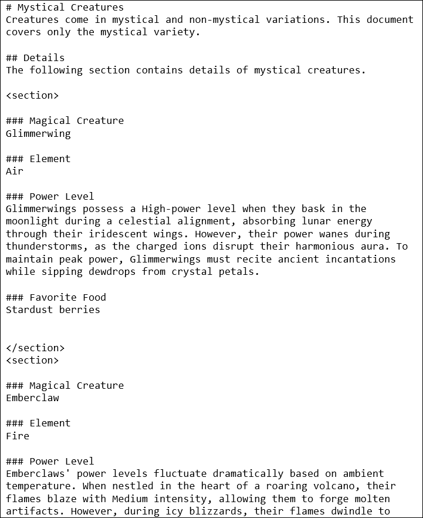

# Dan's Markdown Editor

Thank you for reviewing Markdown Editor! This is a Windows desktop
application that displays its currently selected style while you are
typing and simultaneously displays a preview of how the rendered content
looks.

Although you can use Markdown Editor to create plain, boring, limited
versions of Markdown for strictly regulated places like GitHub, Jira,
and Redmine, this application is intended for reaching far more creative
and lofty goals than that.

Instead, think of branching out from all of the generally defined
Markdown guidelines and making it far more functional and productive
than just a quick way to write presentable text. How about creating
easy-to-read and easy-to-follow linear records on a page where only
tables were previously used, and being able to exchange those records to
places like databases, which only know how to deal with table-based
data?

How about being able to completely dismiss the idea of being stuck with
one Content Management System (CMS) or another, because you can
completely support the content section of separation of roles for your
website through a customized level of Markdown that makes it far easier
for authors to create website pages than when using exact or specific
templates?

We'll get into all of that as the project matures a little. For now, the
following content will help you get started using the application in a
practical sense.

NOTE - Although it is coming soon, there is no binary release at this
moment, but you can clone it and run it from Visual Studio 2017+. If you
absolutely MUST have a compiled version of the application to install
because of not having a configured development environment on your PC,
then please let me know by creating an Issue and I'll make it the first
priority.

&nbsp;

# Markdown Editor User Guide

Welcome to Markdown Editor! This guide will help you to get started with
some of the key concepts and features, particularly the effective use of
Linear Layout Style and the conversion between Linear Layout and Table
Layout styles.

This is the abbreviated version of the guide. If you wish to read the
full, updated version, please check out **MarkdownEditorUserGuide.docx**
in the **Docs** folder.

&nbsp;

## Linear Layout Style

Linear Layout Style tends to avoid using tables, except in rare cases
where limited lists of information make the most sense. Instead, it
relies heavily upon grouping information info markdown's heading levels
to achieve contextual outlining, then employs the use of a special
symbol or key, like HTML &lt;section&gt; tags in this case, to create
distinct partitions between multiplicative entities that need to remain
separated as in the application of slides, frames, entries, or even
discrete records. Here’s an example of how to format content in Linear
Layout Style. Note the smooth, natural flow of text on the page.

&nbsp;

### Linear Style

Following is a linear-style layout of three slides, using HTML sections
as hard partitions between records.

In this style:

-   Each section needing to be delineated from the others is enclosed
    within &lt;section&gt; tags.

-   Within each section, the next available heading level (in this case,
    '###') is used to denote different fields within the content (Slide,
    Narration, Onscreen, etc.).

The main advantages of this approach are that it is easy to maintain and
easy to read. The main disadvantage of this approach is that there are
noticeably more blank lines in the document data.

&nbsp;

## Table Layout Style

Table Layout Style organizes what might be considered the record-level
information of a document into tables, which can be far more structured
but much more difficult to read and manage. In the following example,
note the cramming of text into a tight horizontal space of vast vertical
size, crossing of page borders, and the loss of context on the following
pages:

&nbsp;

## Using HTML Tags in Markdown

When using HTML tags within markdown, such as the &lt;section&gt; tag,
make sure to follow these guidelines.

&nbsp;

### Start and End Tags

In most cases, an HTML element has start and end tags. The start tag is
its name, enclosed in angle brackets, as in the case of
**&lt;section&gt;**, while the matching end tag has the same name but is
also preceded by a forward slash, as in **&lt;/section&gt;**.  
For example, this is a fully qualified section using its start and end
tags:  
&lt;section&gt;This is content in the section.&lt;/section&gt;

&nbsp;

### Separation of HTML and Markdown

Leave an empty line before and after block-style HTML tags, like
sections, for it to be correctly parsed by markdown parsers.

For example:

&nbsp;

### Small Amounts of HTML Can Be Useful

HTML tags can help structure your document more effectively, especially
in Linear Layout Style.

Simple HTML formatting, like that provided by the &lt;b&gt; (bold),
&lt;u&gt; (underline), and &lt;i&gt; italic HTML tags can be especially
useful when complex formatting operations are active. The underline is
especially useful for formatting, considering that markdown doesn't have
an underline code of its own.

&nbsp;

### The HTML 4 Font Tag

Most notably here in Markdown Editor, but still secretly supported
everywhere like in Microsoft Visual Studio Code (VSCode), the use of the
obsolete &lt;font&gt; tag is fully supported, which allows you to set
character and paragraph styling and formatting quickly and easily on
your documents.

For example:

In this usage case, the font tag has three notable attributes.

-   **face**. The font name. The value of this attribute is equal to the
    value you would provide the CSS font-family property.

-   **color**. The font color. In this version, only an HTML hex color
    code (as in \#112233) is accepted. This will be extended to support
    all HTML/CSS color functions in near future versions.

-   **style**. The CSS styles to apply to this font. A pattern like
    **style="font-size:12pt"** will result in a 12-point font size. For
    level of control, this is preferable over the size attribute.

-   **size**. A number between 1 and 7. This attribute doesn't represent
    an actual size, but a setting and constitutes the main disadvantage
    of using the font tag. To set an actual font size, use the style
    attribute with the font-size css property. Refer to the following
    list for specific font sizes on a typical web browser.

    -   1 = 8pt

    -   2 = 10pt

    -   3 = 12pt

    -   4 = 14pt

    -   5 = 18pt

    -   6 = 24pt

    -   7 = 36pt

&nbsp;

### Insert a Section From the Menu

To speed up creating new sections in your markdown file, you can place
your cursor and use the menu option **Edit / Insert Section**
(Ctrl+Shift+I).

&nbsp;

### Display Your Sections in Markdown

HTML section tags are typically invisible. Because markdown allows for
any amount of HTML and CSS to be added directly to a page, however, we
can apply a little bit of CSS styling to make that HTML visible and to
color it in alternating patterns to make it easy to navigate.

Markdown editor has two menu options that allow you to work with HTML
sections inside or outside the editor.

-   **Edit / Load Clipboard with Section Style** (Ctrl+Shift+C). Copy
    the pre-defined CSS section style configuration to the clipboard so
    you can paste it to a markdown page in any other editor.

-   **Edit / Append Section Style to End of Code** (Ctrl+Shift+V).
    Append the pre-defined CSS section style configuration to the end of
    the current markdown file.

&nbsp;

### Export Document Formatting Hints

There are currently two formatting hints available for document export
that are expressed in the form of HTML comments.

&nbsp;

#### FullRow

When used within a table cell, this command instructs the document to
occupy a full row with the text of this cell.

Example:

&nbsp;

#### TableOfContents

Typically used near the beginning of a document, the table of contents
export hint instructs the document builder to add one at the current
location.

Example:

&nbsp;

## Markdown Files

&nbsp;

### Relative Image Paths

This version of Markdown Editor supports the use of relative paths when
images are specified.

To make use of this feature, make sure your Images folder is near the
location of your markdown file, then use only the offset between those
two folder locations to specify the link to the image.

For example, if you have an images sub-folder located in the same folder
as your markdown file, then you could use the following demonstration
line to load an image named 'Car.png':

Notice the use of forward slashes in folder names in markdown, which is
opposite the use of backslashes in Windows path names.

Alternatively, if your Images folder is located one folder back then
inward, relative to your open markdown file, the path to the image would
be expressed using the two-dot notation for backward navigation through
the folder system, as follows:

Note that you are also able to use general URLs to specify the full HTTP
path of the image as well:

&nbsp;

## Markdown Projects

A markdown project is composed of the specific markdown file you are
editing and some additional settings, like filenames for exported Word
and HTML documents, whether you intend to convert linear layout styles
on the current document to table layout style when exporting the
document, and the lists of the following types.

-   **Column Mapping**. Alias headings and headers for quick
    abbreviation and reuse.

-   **Document Styles**. Override the default font name, font color, and
    font size for various document elements.

-   **User Variables**. Create abstract, re-usable references to facets
    and characteristics that are either too detailed to repeat or are
    likely to change often.

You can access the markdown project settings for a project, or even a
stand-alone markdown file, by selecting the menu option **Edit / Project
Options** or pressing Alt+F10. Note that when using project settings
with a stand-alone markdown file, those settings are only temporary
unless the project is created by saving it.

&nbsp;

### Column Mapping

This list allows you to create aliases for headings and headers. While
similar to user variables, in that both are used to replace one bit of
text with another, a column map has more the intention of allowing you
to abbreviate or personalize header content that will be delivered to
the customer differently that you would author that heading yourself.

For example, let's say you always use this header near the end of your
document:

\## Summary

... but that in the same place on the document, would typically provide
the following header for the customer:

\## Conclusion

In this case, your document could benefit from a map consisting of
Summary -&gt; Conclusion.

&nbsp;

### Document Styles

The document styles list allows you to post values for any of the
following pre-defined values in order to override its default value. The
syntax value {1-9} indicates a single required digit with a value of 1
through 9.

<table>
<colgroup>
<col style="width:100%" />
<col style="width:100%" />
<col style="width:100%" />
</colgroup>
<thead>
<tr class="header">
<th>Name</th>
<th>Data Type</th>
<th>Description</th>
</tr>
</thead>
<tbody>
<tr class="odd">
<td>H{1-9}FontColor</td>
<td>HTML Hex-6 (#RRGGBB) or Hex-8 (#RRGGBBAA) color</td>
<td>Heading 1 through heading 9 font colors.</td>
</tr>
<tr class="even">
<td>H{1-9}FontName</td>
<td>Text</td>
<td>Heading 1 through heading 9 font names.</td>
</tr>
<tr class="odd">
<td>H{1-9}FontSize</td>
<td>Floating point number</td>
<td>Heading 1 through heading 9 font size, in points.</td>
</tr>
<tr class="even">
<td>HeadingFontColor</td>
<td>HTML Hex-6 (#RRGGBB) or Hex-8 (#RRGGBBAA) color</td>
<td>Default font color for headings not directly specified.</td>
</tr>
<tr class="odd">
<td>HeadingFontName</td>
<td>Text</td>
<td>Default font name to use on headings not otherwise specified.</td>
</tr>
<tr class="even">
<td>HeadingFontSize</td>
<td>Floating point number</td>
<td>Default font size to use on headings not directly specified, in
points.</td>
</tr>
<tr class="odd">
<td>SectionBackgroundColor</td>
<td>HTML Hex-6 (#RRGGBB) or Hex-8 (#RRGGBBAA) color</td>
<td>Default background color of every section.</td>
</tr>
<tr class="even">
<td>SectionBackgroundColorEven</td>
<td>HTML Hex-6 (#RRGGBB) or Hex-8 (#RRGGBBAA) color</td>
<td>Background color for even-numbered sections.</td>
</tr>
<tr class="odd">
<td>SectionBackgroundColorOdd</td>
<td>HTML Hex-6 (#RRGGBB) or Hex-8 (#RRGGBBAA) color</td>
<td>Background color for odd-numbered sections.</td>
</tr>
<tr class="even">
<td>TableHeaderFontColor</td>
<td>HTML Hex-6 (#RRGGBB) or Hex-8 (#RRGGBBAA) color</td>
<td>Font color for table header cells.</td>
</tr>
<tr class="odd">
<td>TableHeaderFontName</td>
<td>Text</td>
<td>Font name to use on table header cells.</td>
</tr>
<tr class="even">
<td>TableHeaderFontSize</td>
<td>Floating point number</td>
<td>Font size to use on table header cells.</td>
</tr>
</tbody>
</table>

In all of the above entries, the only color codes currently supported
are HTML hex format. However, support for all of the HTML/CSS color
functions will be added in the near future.

&nbsp;

### User Variables

This version of Markdown Editor allows you to create your own variable
names, assign values to them, then insert references to those anywhere
in your document. There is no specific rule about what a variable name
needs to be used for - only that when you reference it from the
document, the name must be enclosed in curly braces. For example,
{MyVariable} is a valid reference to the variable named MyVariable. When
the definition for MyVariable is available, any references in the
markdown text are replaced with the definition text.

For example, in your document, you might include the following
boilerplate near the end of the page.

> Copyright © **{Year}**. My Company, Inc. All rights reserved.

In your user variables list, you would create a variable named **Year**,
and set the value to the current four-digit year.

It is easiest to keep track of variables from a markdown project,
although you can import variables from a package when you have a
stand-alone markdown file open.

&nbsp;

### Project and File Alignment

Each markdown project is associated with a single markdown file. This
association can be set at the time the project is created or any other
time you have it open.

Some of the techniques for aligning a project and markdown file follow.

&nbsp;

#### Open Markdown File Then Save Project As X

This is the most common approach for creating a project. The desired
markdown file is opened for review and a project is created around it.

Here are the specific steps.

-   Select the menu option **File / Open Markdown File**.

-   Select the file from the open file dialog then click **Open**.

-   Select the menu option **File / Save Project As**.

-   Configure the location and name for the project then click **Save**.

&nbsp;

#### Save Project As X, Open Markdown File, Save Project

In this process, the project is created when it is saved but a markdown
file has not yet been set. Use these steps to save the project and
associate the file.

-   Select the menu option **File / Save Project As**.

-   Configure the location and name for the project then click **Save**.

-   Select the menu option **File / Open Markdown File**.

-   Select the file from the open file dialog and click **Open**.

-   At this point, the file name is associated with the project but the
    changes to the project have not yet been saved. Select the menu
    option **File / Save Project**.

&nbsp;

#### Switch Markdown Files with Open Markdown File

After the project and markdown files have already been aligned, you can
change the associated markdown file just by opening another markdown
file then saving the project. Use these steps to switch with the File
Open dialog.

-   Open the project to be realigned.

-   Select the menu option **File / Open Markdown File**.

-   To the **Change Project Source File** prompt, answer **Yes**.

-   Select the new markdown file then click **Open**.

-   Save the changes to the project with the menu option **File / Save
    Project**.

&nbsp;

#### Switch Markdown File in Project Options

Once the project and the markdown file have been aligned, you are also
able to switch source markdown files from within the project options
dialog. Follow these steps to make the change.

-   Open the project to be realigned.

-   Select the menu option **Edit / Project Options**.

-   Next to the **Markdown File** label, you can either update the
    filename in the textbox or click the associated ellipsis button to
    display the Open File dialog.

-   After changing the filename, click **OK** to load the newly
    associated file.

&nbsp;

## Productivity Tips

The following tips may help you to be more productive with markdown.

-   **Segmentation**: Use sections to break down your iterative or
    record-based content into manageable parts. This makes it easier to
    read and edit.

<!-- -->

-   **Headings**: Use appropriate heading levels to organize the content
    within each section.

&nbsp;

### Practical Examples

Here’s a practical comparison of the same content in both layouts:

&nbsp;

#### Table Layout Style

The table layout style typically makes use of paragraph-level contexts
but encloses record-oriented details in a table.

>  src="Images/media/image14.png"
> style="width:100%" />

&nbsp;

#### Linear Layout Style

The linear layout style consistently adheres to context grouping within
a paragraph heading outline, implementing a special mark or symbol for
the sake of separating records. In this version of Markdown Editor, the
HTML &lt;section&gt; tag is used as a record separator.

